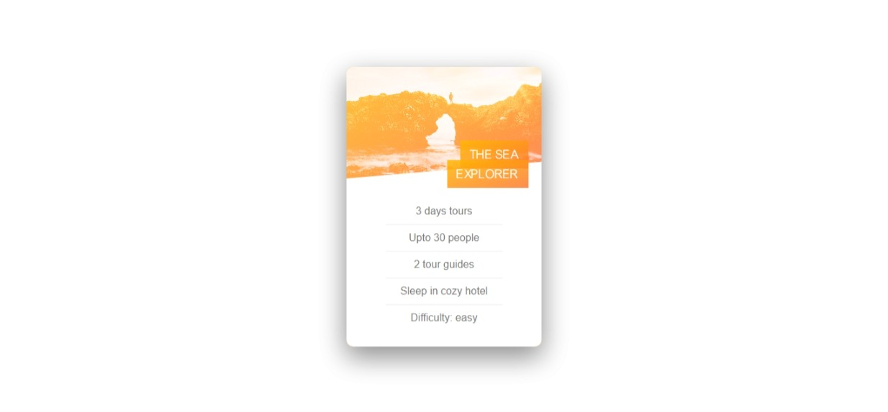

# What I have Learned

-  overflow also has effect on background-image.
-  About perpective, backface-visibility, background-blend-mode, box-decoration-break
-  background-blend-mode only work on images which is determined by css background-image property.
-  box-decoration-break: clone; মানে হলো একটি element break হয়ে যতগুলো box বানাবে সেগুলোর প্রত্যেকটিকে আলাদা আলাদা box হিসেবে ধরবে এবং element টিতে দেওয়া padding,border property; box গুলোতেও apply হবে।
-  clip-path can also break overflow.

## Screenshot

