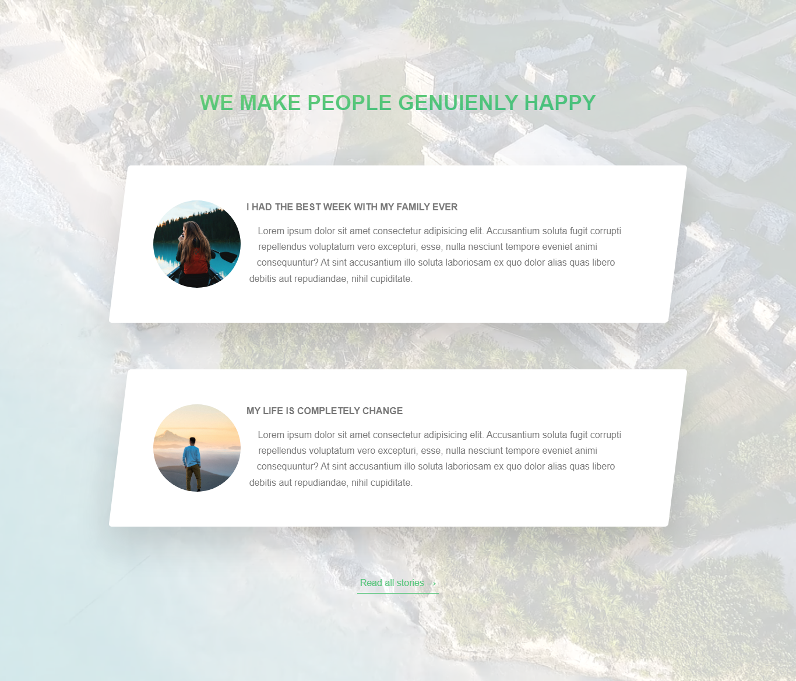

# What I have learned

clip-path can break overflow.

-  'shape-outside' property only works when the element is floated and the element have defines width and height.
-  shape-outside: circle(
   50% at 50% 50%
   );
   -  (radius at width height) -> radius is relative to elements' width and height.
   -  the last two value is also refer elements' width and height and in this example radius will position at horizontally center(2nd 50%) and vertically center(third 50%).
-  float element কে অন্য normal element থেকে সরানোর জন্য margin ব্যবহার না করাই ভালো। এর পরিবর্তে translate ব্যবহার করা যেতে পারে।
-  when make element circle which contain image, use 'clip-path: circle(50% at 50% 50%)' instead of 'border-radius: 50%; and overflow: hidden;'
-  all kind of unexpected shaking occurence during animation or when use any animation related property like transform, opacity then easy fix is use 'backface-visibility:hidden' into the element which occur the shaking.
-  Use video in the background.
-  object-fit: cover; // cover entire parent element while still maintaing its aspect ratio. the part of the video/image don't fit in the parent will clip off
   -  object-fit: fill // not maintain its aspect ratio
   -  object-fit: contain // trying to fill in the parent without clipping any sides'

# ScreenShot

